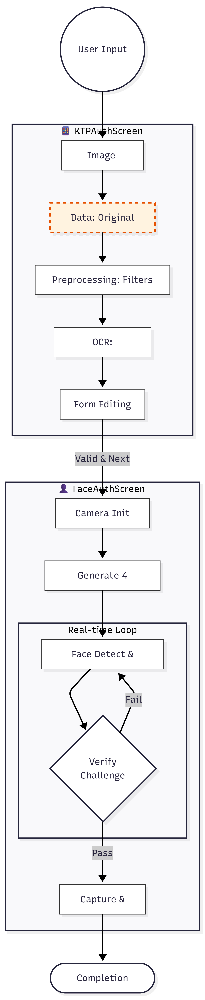

# ID-Scan: KTP Document & Liveness Detection

A Flutter mobile application for automated Indonesian National ID (KTP) document scanning with optical character recognition (OCR) and face liveness detection via challenge-response verification. Designed for identity verification workflows in digital banking, fintech, and KYC applications.

## Features

- **📱 KTP Document Scanning**: Capture and extract KTP documents with image preprocessing and OCR
- **👤 Face Liveness Detection**: Challenge-response based face verification (turn head, smile, blink, etc.)

### System Architecture Diagram



**Diagram Explanation:**

The architecture diagram above illustrates the complete workflow of the ID-Scan application:

1. **Image Capture Layer**: User selects images from gallery or camera
2. **KTP Processing Pipeline**:
   - Image preprocessing via isolate computing
   - Sketch filter and grayscale conversion for contrast enhancement
   - OCR extraction using KtpExtractor native plugin
3. **Form Validation Layer**: Extracted data displayed in editable TextFields for user review
4. **Face Verification Pipeline**:
   - Real-time face detection with ML Kit
   - Challenge generation and randomization
   - Landmark-based verification (head rotation, eye blink, smile)
5. **Output Layer**: Challenge images saved to device gallery with timestamps

## Prerequisites

- **Flutter SDK**: 3.27.4
- **Dart SDK**: 3.6.2
- **Android**: SDK 21+ (API 21)
- **Physical device or emulator** with camera support

## Installation

### 1. Clone the repository

```bash
git clone https://github.com/muhammadRizki12/ID-scan.git
cd ID-scan
```

### 2. Install dependencies

```bash
flutter pub get
```

### 3. Configure platform-specific requirements

#### Android

- Ensure `compileSdkVersion` in `android/app/build.gradle` is set to 34 or higher
- ML Kit is included via google_mlkit_face_detection plugin

#### iOS

- Run CocoaPods dependency manager:
  ```bash
  cd ios
  pod install
  pod repo update
  cd ..
  ```

## Feature Workflow

### 1. KTP Document Scanning (KTPAuthScreen)

1. User taps **"Take a Picture"** button
2. App opens image picker (gallery or camera)
3. Selected image is displayed as `_originalImage`
4. Image preprocessing runs in background isolate via `compute(_applyFilters)`:
   - Resize to 800px width (configurable)
   - Apply sketch filter for edge enhancement
5. Filtered image sent to `KtpExtractor.extractKtp()` native plugin
6. Extracted fields displayed as editable TextFields:
   - NIK (ID number), Name, Birth Date/Place
   - Address (Province, City, District, Sub-district)
   - Gender, Religion, Marital Status, Occupation, etc.

### 2. Face Liveness Detection (FaceAuthScreen)

1. App initializes front-facing camera with NV21 format
2. 4 random challenges selected from:
   - **HADAP_KANAN** (Turn right, headEulerAngleY > 15°)
   - **HADAP_KIRI** (Turn left, headEulerAngleY < -15°)
   - **KEDIP** (Blink, both eyes closed < 0.3 probability)
   - **SENYUM** (Smile, smiling probability > 0.8)
   - **HADAP_ATAS** (Look up, headEulerAngleX < -10°)
   - **HADAP_BAWAH** (Look down, headEulerAngleX > 10°)
3. Real-time face detection runs on each frame:
   - Detects face position and size (minimum 100x100px)
   - Extracts face landmarks and head rotation angles
   - Monitors eye/smile probability
4. When challenge detected, image is captured and saved to gallery with timestamp
5. After 4 challenges pass, user navigates to completion screen

## Core Dependencies

| Package                       | Version   | Purpose                                      |
| ----------------------------- | --------- | -------------------------------------------- |
| `camera`                      | ^0.11.0+2 | Camera access and preview                    |
| `google_mlkit_face_detection` | ^0.12.0   | Real-time face landmark detection            |
| `ktp_extractor`               | ^0.0.2    | Native KTP field extraction (custom plugin)  |
| `image`                       | ^4.5.2    | Image processing (resize, filters, encoding) |
| `permission_handler`          | ^11.3.1   | Runtime permission management                |
| `image_picker`                | ^1.1.2    | Image selection from gallery/camera          |
| `image_gallery_saver_plus`    | ^3.0.5    | Save images to device gallery                |
| `intl`                        | ^0.20.2   | Date formatting (Indonesian locale)          |
| `path_provider`               | ^2.1.5    | Access app directories                       |

## Project Structure

```
ID-scan/
├── lib/
│   ├── main.dart              # App initialization
│   ├── ktp_ocr.dart           # KTP scanning module
│   ├── liveness_detection.dart # Face verification module
│   └── new_page_screen.dart   # Completion screen
├── android/                   # Android-specific code
│   ├── app/src/main/AndroidManifest.xml
│   └── build.gradle
├── ios/                       # iOS-specific code
│   ├── Runner/Info.plist
│   └── Podfile
├── pubspec.yaml               # Flutter dependencies
└── analysis_options.yaml      # Linting configuration
```

## Support

For issues or questions, please refer to:

- [Flutter Documentation](https://flutter.dev/docs)
- [Google ML Kit Documentation](https://developers.google.com/ml-kit)
